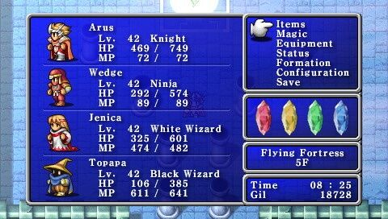

# 🎲 Projeto - Abstraindo um jogo de RPG Usando Orientação a Objetos com C# 🎲

  

- 🎲 Um jogo RPG que abstrai conceitos de POO
- Projeto desenvolvido no BootCamp: Geração Tech Unimed-BH | Fullstack

- Conceitos de POO utilizados: - Herança; - Encapsulamento; - Polimorfismo; - Abstração

## Digital Innovation One - Prática .NET com C# do BootCamp

<h2 id=autor>😎 Desenvolvido por Tassiana Borges</h2>
